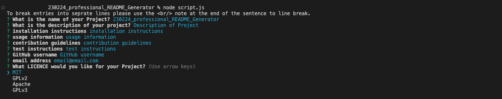

# 230224_professional_README_Generator #

## Description ##
This README Generator Project was created as part of the Bootcamp course with EDx. This runs in Node and uses inquirer and Email validator Npm’s  that allows the user to to enter the Key elements Required to create a professional README file. 

The user enters a description, installation instructions, usage information, contribution guidelines, and test instructions, this information is added to the sections of the README.md file entitled Description, Installation, Usage, Contributing, and Tests. Alongside this the user chooses a license for their application from a list of options, where both a badge and LICENSE file are created inline with their selection.

An example of this output (README.md and LICENSE) can be found in assets/example_output. 
-[README](assets/example_output/example_README.md) 
-[LICENSE](assets/example_output/example_LICENCE) 

•Link to Repo: https://tjhandson.github.io/230224_professional_README_Generator/

•Link to Video: https://drive.google.com/file/d/1gXZ9UGlmmCkMqMgNhUTN6Dy_L-LI3Iut/view?usp=sharing

## Table of Contents ##
•[Installation](#installation)

•[Usage](#usage)

•[License](#license)

•[Contributing](#contributing)

•[Tests](#tests)

•[Questions](#questions)

## Installation ##
### Git
It is recomented to download Git if you are looking to interact with this public repo, Details on downloading this can be found here: https://github.com/git-guides/install-git

### VS Code
Visual Studio Code is a source-code editor (there are others available), The download for this can be found on; https://code.visualstudio.com/download.

### Node.js.
Node.js is an open source server environment which this application would run on, The download for this can be found on; https://nodejs.org/en/download/

### Npm Packages used:

#### Inquirer.js 
provides the user interface and the inquiry session, documentation on installation and use can be found on; https://www.npmjs.com/package/inquirer 

#### email-validator
provides email validation to user input, documentation on installation and use can be found on; https://www.npmjs.com/package/email-validator
  
## Usage ##
This is a public repo and available to be run locally with the packages noted in the Installation section.   Clone project git clone git@github.com:tjhandson/230224_professional_README_Generator.git  

## License ##

The source code for the site is licensed under the MIT License Please refer to the LICENSE in the repo.

## Contributing ##
  
Firstly, thanks for taking the time to contribute! We are happy for any contributions to this repo, with raising issues or reporting bugs.
Please remain respectful to any community members inline with our code of [conduct](code_of_conduct.md) 
All taught and Source material were provided by © 2022 edX Boot Camps LLC.
With implementation of the email validation from the thread https://stackoverflow.com/questions/65189877/how-can-i-validate-that-a-user-input-their-email-when-using-inquirer-npm

   
## Tests ##
When Testing locally, please report any bugs or issues on this repository.
Currently, multiple	line entry (when pressing Enter) to the Inquirer NPM causes this to move onto the next message. 

## Questions ##
if you wish to ask any questions on this project please reach out to tjhandson
